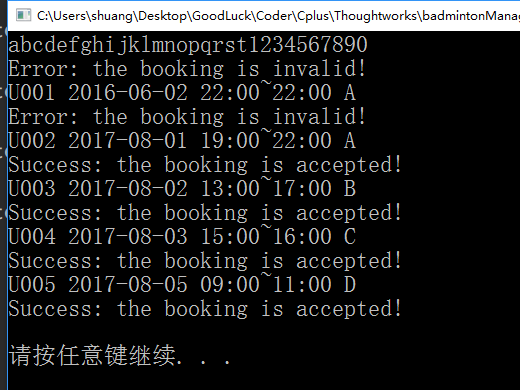
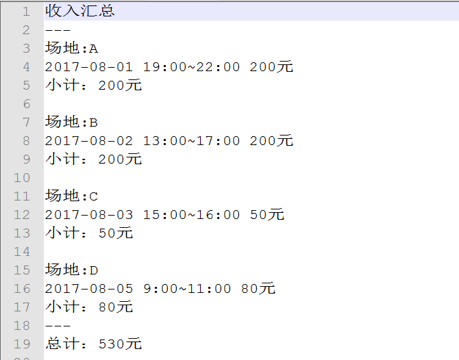
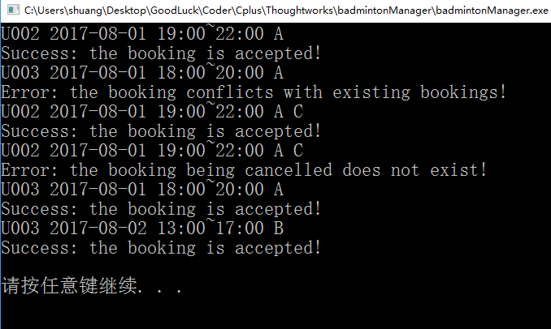
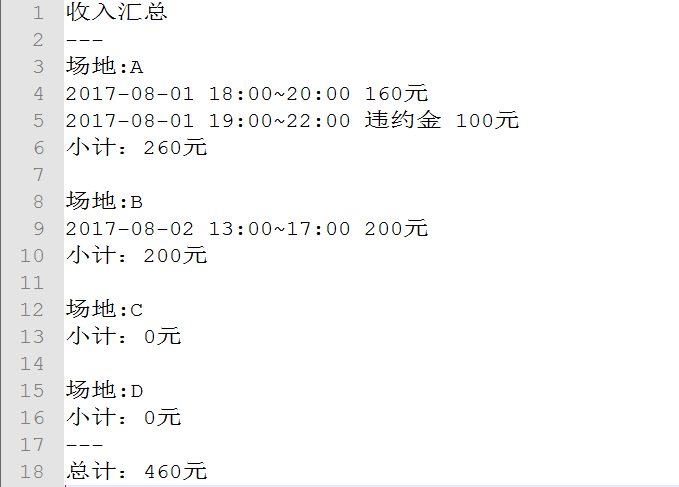

# Code For Thoughtworks Homework

----------
### Description
Design a Badminton field  management system.  And there are four badminton fields, named A, B, C, D.  The charge standard is below:

>Charge for booking
> - Monday to Friday :
	- 9:00 ~ 12:00 30 yuan
	- 12:00 ~ 18:00 50 yuan
	- 18:00 ~ 20:00 80 yuan
	- 20:00 ~ 22:00 60 yuan
> - Saturday to Sunday:
	-	9:00 ~ 12:00 40 yuan
	-	12:00 ~ 18:00 50 yuan
	-	18:00 ~ 22:00 60 yuan

>Fee for canceling the booking:
> - Weekday: 25%
> - Workday: 50%

>Input command demo:
> - U123 2016-06-02 20:00~22:00 A
> - U123 2016-06-02 20:00~22:00 A C

### Environment of the Program
> - This program is developed in [Dev-C++5.11](http://filehippo.com/zh/download_dev-c/).
> - Language: **C++**
> - Operating system: **Window 10**.
> - This program is not depended on any library package which is not included in the system.
> - All the code is developed by myself.  This program could satisfy all the requirement of this homework.  And I have done some unit tests successfully.

### Design of the Program
To satisfy the requirement, there are some classes developed as following:
> - **ConfigTool**:  This class is used to read the configuring file which is universal.
> - **ConfigBadminton**: This class is inherited from ConfigTool, and its member method can resolve configuring variables for Badminton field from the configuring file.
> - **record**: This class is basic type for recording booking or canceling information.
> - **BadmintonField**:  Main class.  Each object of this class is corresponding to Badminton field entity. It should be configured with basic charge information. And it contains some indispensable method, such as booking, canceling and so on.
> - **BadmintonContainer**:  This is a container or factory for BadmintonField. 
> - **ResolveCommand**:  Resolve the command string from standard input stream.
> - **BadmintonRun**:  This class only have one member method for driving all the modules.

This program is configured by a configure file, named 'badmintonManager.config'. And its usage is shown in the annotation of the file. You could change the value of the variables in the configure file to satisfy  new requirement. The meaning of the variables are below:
> - **field**: string for the name of the badminton field.  For example, "ABCD" is for field A, B, C, D.
> - **timeStart1**, **timeEnd1**, **weekFee1**, **workFee1**:  The charge standard for a time interval in weekend and workday.
> - **weekendCancel**: charge for canceling on the weekend.
> - **workdayCancel**: charge for canceling on the workday.

To validate all the modules, I develop a simple Unit test engine referred to gtest and a blog article.
> If you need to test  one class, you could just add a source file according to standard format, and then compile the test project again.

### Test for the Program
This main program is designed to accept lines of commands and output the total incoming information to txt file.  In this program, the txt file named "output.txt" is located in the root directory of the project. And the executable program is also located in the root directory. If your computer is window operating system, you can execute it and test this program.

**Test case 1**
Command intput

Output txt file

**Test case 2**
Command intput

Output txt file

